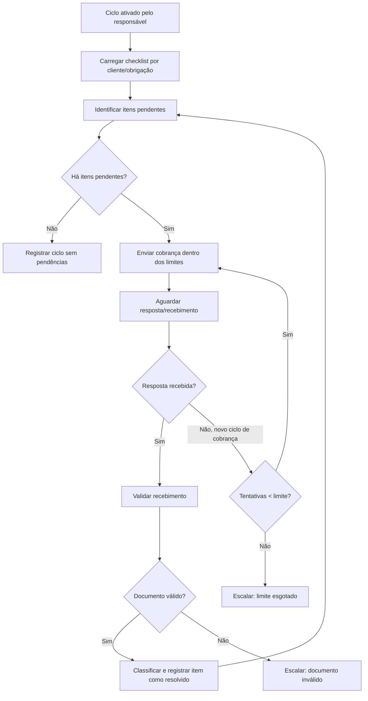
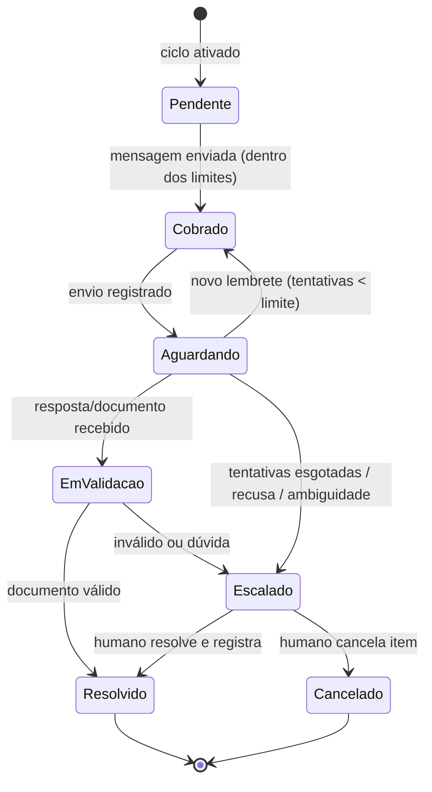

# Fluxo Operacional — Assistente Digital de Pendências Documentais

> **Fase 002 — Discovery do MVP**
> Fluxo operacional do primeiro Funcionário Digital ([`FIRST_DIGITAL_EMPLOYEE.md`](FIRST_DIGITAL_EMPLOYEE.md)). Modelagem conceitual de estados e transições — **não** modelagem de banco de dados nem definição tecnológica.
>
> **NOTA DE ALINHAMENTO (2026-08-30):** este documento mantém os nomes conceituais da Fase 002 (`EmValidacao`, `Escalado`). A máquina **implementada** (banco + motor) usa os estados do CHECK em `packages/db/migrations/0002_business.sql` e da [SRV-10 §2](../factory/spikes/SRV-10-mvp01-slice.md): `pendente → cobrado → aguardando → recebido → resolvido/cancelado/excecao` (mapeamento: `recebido` = `EmValidacao`; `excecao` = `Escalado`; estado reservado `cobrado` para canal assíncrono). O nome conceitual de referência para o código é o do motor (`apps/api/src/motor/engine.ts`). Histórico da Fase 002 preservado.

## Visão geral do fluxo

## Estados de um item de pendência

## Definições

### Estado inicial

- **Ciclo não iniciado.** Nenhuma ação automática ocorre antes da ativação explícita do ciclo pelo responsável do escritório (ponto de aprovação humana — ver [`FIRST_DIGITAL_EMPLOYEE.md`](FIRST_DIGITAL_EMPLOYEE.md)).

### Estados intermediários

| Estado | Significado |
|---|---|
| `Pendente` | Item no checklist ainda não cobrado no ciclo |
| `Cobrado` | Pelo menos uma cobrança enviada e registrada |
| `Aguardando` | Última cobrança enviada; aguardando resposta |
| `EmValidacao` | Recebimento em verificação básica |
| `Escalado` | Encaminhado a humano; Funcionário Digital não age mais sozinho no item |

### Estado final

- **Ciclo encerrado** quando todos os itens estão `Resolvido`, `Cancelado` ou permanecem `Escalado` com decisão humana registrada; relatório de fechamento gerado.

### Falhas

- Falha técnica de envio: registrada com motivo; nova tentativa conforme política de retries;
- Falha repetida (limite técnico): item vai a `Escalado` com diagnóstico básico;
- Nunca há falha silenciosa (princípio *Explicit Failure*).

### Retries

- Envio de mensagem: retry técnico automático para falhas transitórias, com contagem separada das tentativas "sociais" (cobranças ao cliente);
- Validação de arquivo: reprocessável sem efeito colateral (operação idempotente);
- Retries nunca disparam nova comunicação ao cliente final.

### Cancelamento

- Somente humano pode cancelar item ou ciclo (`Cancelado`), com registro de motivo;
- O Funcionário Digital pode **sugerir** cancelamento via escalonamento, jamais executá-lo.

### Intervenção humana

Pontos formais:

1. ativação do ciclo;
2. tratamento de itens `Escalado`;
3. aprovação de qualquer ação fora dos limites configurados;
4. revisão do relatório de fechamento com pendências críticas.

### Evidências

Toda transição de estado gera evidência registrada: mensagem enviada (conteúdo + destinatário + timestamp), resposta/documento recebido (origem + conteúdo), resultado de validação (critério + veredito), identidade de quem aprovou intervenções.

### Rastreabilidade

Trilha completa por item e por ciclo, reconstrutível posteriormente (princípio de Auditabilidade). Cada ação vincula: funcionário digital responsável, tenant, cliente, item, template usado e limites vigentes no momento.

## Human-in-the-loop — regras operacionais

| Situação | Humano deve... |
|---|---|
| Início de ciclo | **Ativar** (aprovação prévia obrigatória) |
| Comunicação fora dos templates/limites | **Aprovar** antes do envio |
| Exceção escalada | **Revisar e decidir** |
| Rotina normal dentro dos limites | Ser **notificado** apenas nos resumos periódicos |
| Limite de tentativas esgotado | **Decidir** próximo passo |
| Item crítico perto do prazo | Ser **notificado** imediatamente |

### Quando o Funcionário Digital deve parar

- Ao atingir qualquer limite configurado;
- Diante de ambiguidade, recusa ou questionamento do cliente;
- Diante de falha técnica repetida;
- Diante de qualquer situação não prevista nas regras.

### Quando pode tentar novamente sozinho

- Falhas técnicas transitórias (retry seguro, sem contato com o cliente);
- Novos ciclos de cobrança dentro do limite de tentativas e intervalos configurados.

### Quando uma tarefa é considerada irreversível

Qualquer comunicação efetivamente enviada ao cliente final é irreversível — por isso exige: template aprovado, limites respeitados e registro auditável **antes** do envio. Ações destrutivas (exclusão) e alterações de configuração são sempre humanas.
