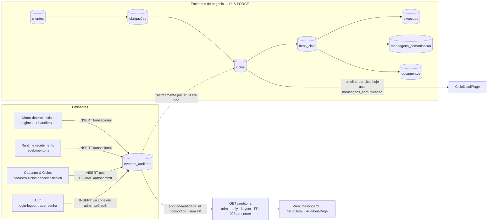
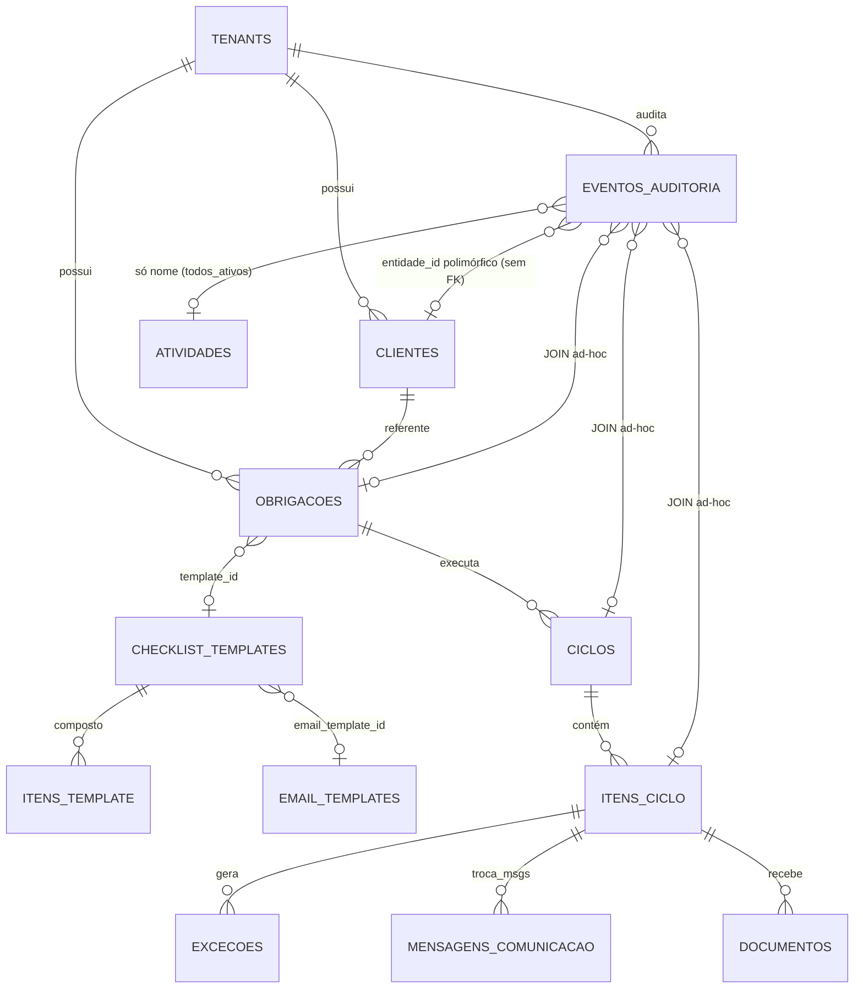
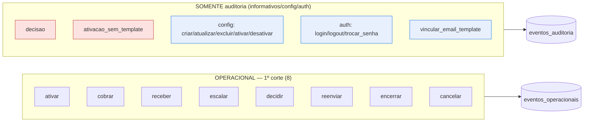
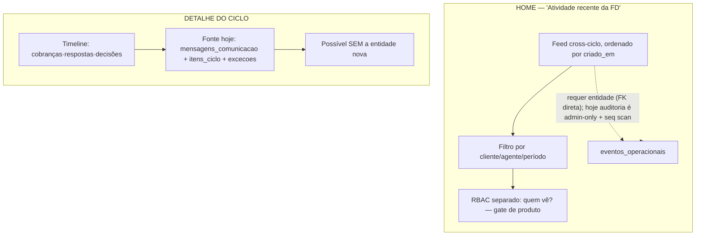

# ADR-012 — Technical Review

> **Escopo:** revisão arquitetural READ-ONLY da proposta `eventos_operacionais` (ADR-012 `Proposed`) contra o estado real do repositório. Nenhuma alteração de código, schema, ADR, requisito ou UI. Nenhum commit/PR.
>
> **Método:** inspeção direta de migrations, emissores, API, frontend e documentação vigente; classificação por evidência (`CONFIRMADO/PARCIALMENTE CONFIRMADO/INCONSISTENTE/NÃO ENCONTRADO/RISCO`).

## 1. Executive Summary

- O problema declarado (atividades de UX sem vínculo estrutural com Obrigação→Ciclo→Item) é **real e confirmado no código**: não existe entidade operacional de primeira classe; o registro de execução vive em `eventos_auditoria` **polimórfico e sem FK de negócio**, complementado por `mensagens_comunicacao`, `documentos`, `excecoes` e `itens_ciclo.atualizado_em`.
- A cadeia `Cliente → Obrigação → Ciclo → Item` **já existe como modelo relacional real** (`clientes → obrigacoes → ciclos → itens_ciclo`, com FKs e RLS FORCE). O que falta é o **elo Evento→Item/Ciclo com FK estrutural e semântica de "o que aconteceu"** — tudo hoje depende de `entidade/entidade_id` polimórfico + JOIN ad-hoc.
- A proposta `eventos_operacionais` é **coerente com a arquitetura** (shared-schema + RLS FORCE + append-only são padrões já estabelecidos e replicáveis), **preserva** multi-tenancy e pode ser **append-only** caso seja aplicado o mesmo `REVOKE` usado em `eventos_auditoria` (`0003_rls_security.sql:44`).
- **Conflito de nomenclatura confirmado:** `atividades` **é configuração de rotina recorrente** (`0014_atividades_agentes.sql:64`), com semântica de domínio oposta à proposta. Nomear a nova camada "atividade" é **RISCO ALTO**.
- **Auditoria × operacional:** a separação é correta, com um cuidado: hoje **todos** os eventos operacionais já são emitidos em `eventos_auditoria`, dentro das mesmas transações de negócio. `eventos_operacionais` implica **dual-write** (2 INSERTs por ação) ou **realocação** do emissor — decisão que precisa ser explícita (não resolvida silenciosamente).
- **Rastro forte já existe para execução:** os eventos de ciclo/item (`ativar`, `cobrar`, `receber`, `escalar`, `encerrar`, `decidir`, `reenviar`, `cancelar`) são transacionais e rastreáveis por FK. Rastro **fraco/indireto**: configuração, autenticação e `decisao`/`ativacao_sem_template`.
- **Conclusão:** ADR-012 em `Proposed` está **fundamentalmente correto**, mas depende de refinamentos nas decisões **D3** (escopo do primeiro corte) e **D5** (dependência da UX por visão), além das decisões D1/D2/D4 (recomendado manter com ressalvas). **NÃO implementar** até as D1–D5 serem aprovadas.

## 2. Current Architecture

- **Estilo:** monorepo pnpm (packages: `db`, `shared-types`; apps: `api`, `web`, `e2e`), shared-schema multi-tenant, ADR-005 (RLS deny-by-default).
- **Persistência:** PostgreSQL (ADR-004). 14 migrations (`0001_core.sql`…`0014_atividades_agentes.sql`).
- **Camada de dados:** conexão contextualizada por tenant (`setTenant`) → RLS; role única `servium_app`.
- **Execução:** motor **determinístico puro** (`apps/api/src/motor/engine.ts`, ADR-010 sem LLM) + fila PG (`jobs_fila` + `enqueue`, ADR-006) + worker (`apps/api/src/runtime/`), com correlação de respostas (`PRM-P0.1-E`).
- **Auth/RBAC:** sessões opacas server-side (ADR-009), papéis `admin`/`operador`; auditoria de credencial via conexão `admin` pré-auth (exceção documentada).
- **Camada operacional de leitura (FR-028, commit `0de4155`):** `GET /auditoria` (admin-only) enriquece `eventos_auditoria` com cliente/atividade/agente via JOIN seguro em lote.



### Modelo relacional real (FKs e cardinalidades)

| Entidade | FKs diretas | Cardinalidade | Notas |
|---|---|---|---|
| `clientes` | `tenant_id → tenants` | — | raiz da cadeia de negócio |
| `obrigacoes` | `tenant_id`, `cliente_id → clientes`, `template_id → checklist_templates` (0005) | 1 cliente : N obrigações | |
| `checklist_templates` | `tenant_id`, `email_template_id → email_templates` (0013) | 1 template : N itens_template | |
| `ciclos` | `tenant_id`, `obrigacao_id → obrigacoes`, `ativado_por → operadores`, `config jsonb` | 1 obrigação : N ciclos | estado CHECK `aberto/encerrado/cancelado` |
| `itens_ciclo` | `tenant_id`, `ciclo_id → ciclos`, `item_template_id → itens_template` | 1 ciclo : N itens | estado CHECK 7 valores; `tentativas` |
| `excecoes` | `tenant_id`, `item_ciclo_id → itens_ciclo`, `decidido_por → operadores` | 1 item : N exceções (aberta = `desfecho IS NULL`) | |
| `mensagens_comunicacao` | `tenant_id`, `item_ciclo_id → itens_ciclo` (NULL) | 1 item : N msgs | `UNIQUE(tenant_id, idempotency_key)`; `token_correlacao` |
| `documentos` | `tenant_id`, `item_ciclo_id → itens_ciclo` (NOT NULL) | 1 item : N docs | `origem` CHECK no recebimento |
| `eventos_auditoria` | `tenant_id` **somente**; `actor_id` sem FK; `entidade_id` **sem FK (polimórfico)** | 1:N por entidade | append-only via REVOKE |
| `atividades` (0014) | `tenant_id`, `agente_id → agentes`, `checklist_template_id → checklist_templates` | 0..N clientes (escopo `todos_ativos`) | **configuração** FR-020 |
| `agentes` (0014) | `tenant_id` | catálogo por tenant (seed trigger) | GRANT **SELECT only** |

## 3. Current Activity Model

- **`atividades` = configuração de rotina recorrente** (FR-020), não registro de ocorrência. Evidência: `0014_atividades_agentes.sql:64-84` — `periodicidade`, `escopo='todos_ativos'`, `agente_id`, `checklist_template_id`, `comportamento jsonb`, `status`. **Sem relação com cliente**, **sem relação com ciclo**.
- **Não existe** nenhuma abstração de "atividade operacional"/"event"/"timeline"/"history" no código. Busca: nenhuma ocorrência de `eventos_operacionais`, `operational_activity`, `timeline`, `activity` no backend/frontend além de `AtividadesPage` (config).
- **De onde a UX "atividade" obtém dados hoje:**
  - **Dashboard** (`DashboardPage.tsx`): apenas `GET /ciclos` (cards + tabela "Ciclos recentes"). **Não há feed de atividade.**
  - **CicloDetailPage** (`ciclos.controller.ts:105-113` + `CicloDetailPage.tsx`): pseudo-timeline da execução a partir de **`mensagens_comunicacao`** (envio/recebimento do item) + estado de `itens_ciclo` + `excecoes`. Não usa eventos de auditoria.
  - **AtividadesPage**: CRUD de configuração (`/atividades`).
  - **AuditoriaPage**: `GET /auditoria` (admin-only), já com camada `operacional` (FR-028).
- **Conclusão:** a "atividade recente" que a UX futura quer é **hoje reconstruída por JOIN ad-hoc** por leitura, sem fonte estrutural dedicada.

## 4. Current Audit Model

- **Tabela `eventos_auditoria`** (`0002_business.sql:120-130`): `actor_type` CHECK (`sistema`/`operador`/`servico`), `actor_id` (NULL p/ sistema), `entidade` (text), `entidade_id` (uuid, sem FK), `acao`, `detalhes` jsonb.
- **Append-only:** `REVOKE UPDATE, DELETE ON eventos_auditoria FROM servium_app` (`0003_rls_security.sql:44`) — **única** tabela append-only do projeto.
- **RLS:** incluída no loop FORCE de `0003` (`:25-35`); leitura sem contexto retorna 0 linhas; escrita fora do tenant falha (`WITH CHECK`).
- **Leitura:** `listarEventos` (`packages/db/src/audit.ts`) com keyset `(criado_em DESC, id DESC)`; **sem `WHERE tenant_id`** (isolamento só por RLS); índice `idx_eventos_tenant_criado` (`0002:156`).
- **Emissores (21 ações · 29 linhas — inventário reconciliado em `EVENTOS_AUDITORIA.md` §3):** transacionais (motor + runtime + decidir/reenviar/cancelar) e **não transacionais** (cadastro pós-COMMIT: `criar`/cliente, `criar`/obrigação, `criar`/checklist_template, `criar`/atualizar/ativar/desativar/atividade, `criar`/atualizar/excluir/email_template, `vincular_email_template`, `ativar` HTTP).

### Classificação por domínio

| Domínio | Ações | Emissor | Uso na UX |
|---|---|---|---|
| **Configuração/administração** | `criar`, `atualizar`, `excluir`, `vincular_email_template`, `ativar`/`desativar` (atividade), `criar` (cliente/obrigação/template) | operador (cadastro) | **não usado** na UX de atividade |
| **Autenticação** | `login_sucesso`, `login_falha`, `login_block`, `logout`, `trocar_senha`, `trocar_senha_falha` | operador (auth) | **não usado** |
| **Execução operacional** | `ativar` (ciclo), `ativacao_sem_template`, `decisao`, `escalar`, `cobrar`, `encerrar`, `decidir`, `reenviar`, `receber`, `cancelar` | motor/runtime/operador | presenter FR-028; **hoje não há feed** |

## 5. Obligation → Cycle → Item Traceability

Cadeia real e end-to-end **confirmada por FKs**:

```
clientes ──< obrigacoes ──< ciclos ──< itens_ciclo
                 │ (template_id → checklist_templates → itens_template/email_templates)
                 └──< excecoes (item_ciclo_id)
                 └──< mensagens_comunicacao (item_ciclo_id NULL)
                 └──< documentos (item_ciclo_id NOT NULL)
```



- Vínculo **cliente→obrigação→ciclo→item**: `CONFIRMADO` (FKs reais; RLS FORCE em todos os níveis).
- Vínculo **evento→item/ciclo**: **INEXISTENTE** — `eventos_auditoria.entidade_id` não tem FK; a reconstrução hoje se dá no controller (`enriquecerContexto`, `auditoria.controller.ts:96-180`) e no filtro `cliente_id` (`packages/db/src/audit.ts:106-124`) via subquery JOIN polimórfico.
- **Rastreabilidade forte** (por FK + transação): execução do ciclo (ver §15).

```mermaid
flowchart TB
    subgraph Ativo["Rastreável (FKs reais)"]
        CL3[Cliente] --> OBR3[Obrigação] --> CIC3[Ciclo] --> IT3[Item]
    end

    subgraph Fragil["Rastreável por JOIN/filtro (FR-028)"]
        EV[evento_auditoria<br/>entidade="ciclo|item_ciclo|cliente|obrigacao"] -->|entidade_id resolve...| RES[cliente/atividade<br/>enriquecidos em lote]
    end

    subgraph Perdido["Sem fonte estrutural"]
        NEX["resultado em linguagem de negócio"]:::risco
        PROX["próxima ação"]:::risco
        FEED["feed global 'Atividade recente da FD'"]:::risco
    end

    IT3 -.-> EV
    RES -.-> NEX

    classDef risco fill:#fde2e2,stroke:#c0392b
```

## 6. ADR-012 Proposal Validation

| # | Pergunta | Veredito | Evidência |
|---|---|---|---|
| 1 | O modelo resolve o problema? | **PARCIALMENTE CONFIRMADO** — resolve, com custo de dual-write a decidir | emissores já gravam em `eventos_auditoria` (handlers.ts:45-58, recebimento.ts:133-147) |
| 2 | A relação Cliente→Obrigação→Ciclo→Item→Evento é compatível? | **CONFIRMADO** — a cadeia existe; o elo evento é o único `entidade_id` polimórfico sem FK | `0002_business.sql`; `auditoria.controller.ts` |
| 3 | `eventos_operacionais` é coerente? | **CONFIRMADO** — replica padrão RLS/append-only/tenant_id já usado | `0003`, `0014` |
| 4 | Preserva RLS/multi-tenant/append-only? | **CONFIRMADO, condicionado** — exige incluir no FORCE + `REVOKE UPDATE/DELETE` | `0003:25-44` |
| 5 | Separação operacional × auditoria correta? | **CONFIRMADO** conceitualmente; na prática são a **mesma origem** hoje | §4 |
| 6 | Conflito com `atividades`? | **RISCO** (colisão semântica confirmada) | `0014:64-84` |
| 7 | Quais eventos são operacionais? | **PARCIALMENTE CONFIRMADO** — 10 ações executam negócio; `decisao`/`ativacao_sem_template` são informativos | §9 |
| 8 | Quais permanecem só em auditoria? | **CONFIRMADO** — auth + configuração + administrativos | §9 |
| 9 | Dados/relações a preservar? | **CONFIRMADO** — FKs, RLS, tokens de correlação, `UNIQUE(tenant,idempotency)`, CHECKs | §2 |
| 10 | Risco de duplicação/inconsistência entre as 5 fontes? | **RISCO** — dual-write, eventos sem ciclo, cadastro não-atômico | §17 |
| 11 | Suporta a UX (feed/timeline/pedido/FD/…)? | **PARCIALMENTE CONFIRMADO** — feed global precisa da entidade; timeline por ciclo já é possível com joins (§11) | CicloDetailPage |
| 12 | Decisões humanas pendentes? | **CONFIRMADO** — D1–D5 (§20) + 2 propostas de alteração (§19) | — |

## 7. D1 — Naming

- **Adequação:** `eventos_operacionais` é **adequado e técnico**: descreve o que a camada faz (registro de eventos da execução) sem colidir com `atividades`, `ciclos` ou `auditoria`.
- **Conflito com `atividades`:** `CONFIRMADO`. Em `0014`, `atividades` = **rotina recorrente configurada** (FR-020). Existe ainda precedente documental de `entidade='atividade'` em `eventos_auditoria` (config). Usar "atividade" para a nova camada criaria ambiguidade em domínio, schema, API e UI.
- **Alternativas consideradas:** `registro_operacional`, `atividades_execucao`, `ocorrencias` — nenhuma supera `eventos_operacionais` em clareza. **Recomendado manter `eventos_operacionais`. Não se propõe rename/refactor de `atividades` (sem evidência de que esteja errada; ver D4).**

## 8. D2 — Architectural Model

| Critério | **A** — `eventos_operacionais` (Nova entidade) | **B** — graduar `eventos_auditoria` (FKs nullable) | **C** — só camada de apresentação |
|---|---|---|---|
| Vantagens | FKs reais; semântica clara; RBAC separado (ex.: operador lê feed sem liberar auditoria); query simples; feed global viável; evolução (PRÓXIMA AÇÃO/resultado) | Zero novo write path; aproveita append-only/RLS já prontos; sem dual-write | Zero custo de schema; entrega UX imediata |
| Desvantagens | **Dual-write** (2 INSERTs por ação) ou realocação de emissores; migração/backfill | Mantém dívida polimórfica (`entidade/entidade_id` sem FK); mix de domínios numa tabela única; hardening de RBAC ("quem é operacional?" vira filtro) | **Não resolve** rastreabilidade estrutural; cada visão reinventa JOIN; sem FK; sem fonte de verdade para "o que aconteceu"; feed global impraticável/seq scan |
| Impacto | Nova migration + revisão de emissores + presenter FR-028 | Alterar CHECK/colunas + índices; risco de vazamento semântico | Nenhum no schema; alto na lógica de apresentação |
| Riscos | Duplicação/inconsistência A×auditoria | Poluição do modelo de auditoria (append-only de compliance com eventos de produto) | Dívida crescente; não atende o "problema arquitetural" descrito |
| Aderência à arquitetura | **Alta** — replica padrão estabelecido (RLS FORCE/REVOKE/GRANT, tenant_id) | Média — estica o polimorfismo existente | Baixa — não altera o modelo |
| Rastreabilidade | Forte (FK direta evento→item/ciclo) | Indireta (entidade_id polimórfico + JOIN) | Indireta e duplicada |
| UX futura | Suporta feed global, timeline, próximo passo, paginação por ciclo | Parcial; por ciclo ok, global pesado | Parcial (ciclo ok) |

**Recomendação técnica explícita (não é decisão):** **Opção A** — nova entidade `eventos_operacionais` (mantém ADR-012), **com as seguintes condições mínimas**:

1. Mesmos emissores transacionais atuais, **dentro das transações existentes** (não duplicar fora);
2. Decisão explícita entre **dual-write atômico** (INSERT nos dois) vs **migração gradativa** do emissor operacional para a nova tabela com derivada de auditoria — **decisão humana (D2-b)**;
3. Manter `eventos_auditoria` como trilha de compliance (não deletar/alterar); o presenter FR-028 passa a ler a fonte escolhida;
4. Não fazer backfill do histórico por ora (ver Riscos §17).

## 9. D3 — First Cut Scope

Eventos **reais** (código/documentação), classificados:

| Evento | Origem atual (arquivo:função) | Operacional? | Ciclo | Item | Auditoria | Observação |
|---|---|---|---|---|---|---|
| `ativar` | HTTP `ciclos.controller.ts:17-45` (operador) + motor `handlers.ts:69` (sistema/servico) | **Sim** | ✓ (nível ciclo) | ✗ | ✓ | 2 emissores do mesmo conceito ⇒ risco de evento duplicado no feed |
| `ativacao_sem_template` | motor `handlers.ts:80` | **Não** (sinal de config ausente) | ✓ | ✗ | ✓ | **informativo**; fora do 1º corte do feed |
| `decisao` | motor `handlers.ts:149` | **Não** (decisão interna `nada/aguardar`) | via | ✓ | ✓ | **ruído de alta frequência** (todo tick sem ação); fora do feed |
| `escalar` | motor `handlers.ts:172` | **Sim** | via | ✓ | ✓ | + `excecoes` (FK) |
| `cobrar` | motor `handlers.ts:255` | **Sim** | via | ✓ | ✓ | guarda `rodada`; par com `receber` via token |
| `encerrar` | motor `handlers.ts:300` e `handlers.ts:327` | **Sim** | ✓ | ✗ | ✓ | UPDATE condicionado ⇒ 1 evento por encerramento real |
| `decidir` | `decidir-item.ts:78-82` (operador) | **Sim** | via | ✓ | ✓ | intervenção humana; + atualização de `excecoes` |
| `reenviar` | `ciclos.controller.ts:236-240` (operador) | **Sim** | via | ✓ | ✓ | encerra exceção (`desfecho='reenviado'`) |
| `receber` | `recebimento.ts:192-197` (sistema/servico) | **Sim** | via | ✓ | ✓ | idempotente por `message_id`; carrega `token` |
| `cancelar` | `cancelar-ciclo.ts:34-38` (operador) | **Sim** | ✓ | ✗ | ✓ | transacional |

**Conclusão D3:** o 1º corte correto é **exatamente os 8 eventos de execução com efeito de negócio** (`ativar`, `escalar`, `cobrar`, `encerrar`, `decidir`, `reenviar`, `receber`, `cancelar`). **`decisao` e `ativacao_sem_template` devem permanecer somente em `eventos_auditoria`** (informativo/config) — ver Proposta de Alteração §19.1.



## 10. D4 — Relationship with `atividades`

- **Propósito atual (evidência):** `0014_atividades_agentes.sql`. `atividades` = **configuração de rotina recorrente** (FR-020): periodicidade, escopo multi-cliente, agente executor (FR-021), checklist vinculado, comportamento. **Não executa nada** (o próprio comentário: "NÃO cria motor de execução/recorrência FR-022 — apenas configuração").
- **Relação com agente:** sim (FK `agente_id → agentes`) — o agente executor (`estagiaria-digital`).
- **Relação com checklist:** sim (`checklist_template_id`, `ON DELETE SET NULL`).
- **Relação direta com cliente:** **não** (escopo `todos_ativos` — difere da cadeia da proposta, que é por cliente).
- **Relação direta com ciclo:** **não**.
- **Deve continuar existindo:** **sim** — é a definição de serviço recorrente; a futura execução (FR-022) produzirá ciclos/itens a partir dela.
- **Deve ser renomeada:** **não** — renomear sem evidência viola a orientação; o conflito é resolvido nomeando a **nova** camada (`eventos_operacionais`).
- **Deve ser relacionada ao novo modelo:** **sim, de forma indireta e futura** — `eventos_operacionais` referencia `ciclo/item`; como o ciclo nasce de uma obrigação (não de uma atividade) **hoje**, o vínculo atividade→execução fica **para o FR-022**, quando a execução da atividade recorrente materializar obrigação/ciclo. Não forçar FK atividade→evento agora (não há FK de ciclo→atividade no código).
- **Coexistência:** **sim, paralela e sem conflito** — `atividades` (config) ≠ `eventos_operacionais` (acontecimento). Confirmada a recomendação D4 atual.

## 11. D5 — UX Dependency

Comparação evidência-baseada:

| Visão UX | Somente joins (hoje) | Com `eventos_operacionais` | Veredito |
|---|---|---|---|
| **Feed global "Atividade recente da FD" (Home)** | Impedido na prática: ler 5 tabelas + `eventos_auditoria` polimórfico + seq scan + RBAC de auditoria (admin-only) | Query simples por `criado_em DESC` com FK direta | **Depende da entidade** — SIM |
| **Timeline por ciclo (detalhe)** | **Já existe**: `CicloDetailPage` usa `comunicacoes` + `itens_ciclo` + `excecoes` | Melhor (inclui decisões/escaladas), porém **não bloqueia** | **Não depende** — viável com joins hoje |
| **Pedido→Cliente→Obrigação→Ciclo→Timeline** | Via FKs (ciclo→obrigação→cliente) — ok | Homogêneo | Não depende |
| Rastreabilidade estrutural | Indireta (entidade polimórfica) | Forte (FK) | Entidade |
| Consistência | Duplicada por visão | Fonte única de "o que aconteceu" | Entidade |
| Performance/paginação | Seq scan; paginação só audit | Índice `(tenant_id, criado_em DESC)` + keyset | Entidade |
| Auditoria/debug/explicabilidade | Auditoria vira UI (vazamento conceitual) | Auditoria segue compliance; feed é produto | Entidade |
| Evolução (próxima ação, resultado estruturado) | Hacks por cenário | Campos da proposta (`titulo/resultado`) | Entidade |



**Conclusão D5:** a dependência da entidade é **total para o feed global** e **inexistente para o timeline por ciclo**. A proposta atual ("UX depende de eventos_operacionais") é **over-generalized** → Proposta de Alteração §19.2.

## 12. Proposed Data Model Review

`eventos_operacionais` (campos propostos):

| Campo | Necessário? | Redundante? | Derivável? | FK? | NULL? | Risco de inconsistência | RLS | Índice |
|---|---|---|---|---|---|---|---|---|
| `id` | Sim | — | — | PK (`gen_random_uuid`) | Não | — | — | PK |
| `tenant_id` | **Sim** | Não | Não | → `tenants` (obrigatório) | Não | Sem ele não há RLS | Base do RLS | Juntamente com `criado_em` |
| `ciclo_id` | **Sim** | Não | Não | → `ciclos` | Não (sempre há ciclo) | — | via FK (RLS duplicado) | Sim (feed por ciclo) |
| `ciclo_item_id` | Sim | Não | Não | → `itens_ciclo` | **Sim** (eventos de nível ciclo: ativar/encerrar/cancelar) | Exige consistência com `ciclo_id` | via FK | Sim |
| `cliente_id` | **Questionável** | **Sim** (derivável por `ciclo→obrigação→cliente`) | **Sim** | Sem FK **ou** FK + CHECK de consistência | Não quando há ciclo | **Sim — fonte de divergência** | via FK | Sim (feed por cliente; não necessário p/ próprio feed) |
| `tipo` | Sim (categorizar: cobrança/recebimento/decisão/…) | Não | Não | Não (enum no app) | Não | — | — | Combinado com `ator_tipo` para triagem |
| `ator_tipo` | Sim | — | — | Não (`sistema/operador/servico` — reaproveita convenção §2.5) | Não | — | — | feed por agente (FD vs humano) |
| `ator_id` | Sim | — | — | **Sim** → `operadores` quando humano; `agentes` quando servico | **Sim** (`sistema` sem id) | — | — | quando ator operador |
| `titulo` | **Sim** (produto: rótulo amigável do feed) | Não | Parcialmente (pode derivar de `tipo`+template no presenter) | Não | Não | — | — | busca texto (opcional) |
| `descricao` | Sim | Não | Não | Não | Sim | — | — | — |
| `resultado` | Sim | Não | Não | Não (**jsonb** recomendado: ex.: `{desfecho}`, `{rodada}`, `{motivo}`) | Sim | — | — | — |
| `contexto_tecnico` | Sim | — | — | Não (`jsonb`) | Sim | — | — | — |
| `criado_em` | Sim | Não | Não | — | Não | — | — | **Índice composto `(tenant_id, criado_em DESC)`** (feed keyset) |

**Sobre a desnormalização de `cliente_id`:**

- É **derivável** por `ciclo → obrigação → cliente` — armazená-lo é **denormalização consciente** para o feed global (evita 3 JOINs por linha e permite o filtro `cliente_id` sem subqueries).
- **Justificável** para performance do feed, **desde que** haja constraints de proteção:
  1. `NOT NULL` (evento operacional sempre tem cliente);
  2. **FK `→ clientes`** (evita órfão);
  3. **CHECK de consistência** (`ciclo_item_id IS NULL OR ciclo_id = (SELECT ciclo_id FROM itens_ciclo WHERE id = ciclo_item_id)`), ou validação por trigger/validação transacional;
  4. Recomendado: trigger `BEFORE INSERT` que verifica `cliente_id = (SELECT o.cliente_id FROM ciclos c JOIN obrigacoes o ON o.id=c.obrigacao_id WHERE c.id=ciclo_id)` — custo aceitável e previne divergência.
- **Alternativa mais segura:** manter `ciclo_id` FK e **omitir** `cliente_id` (derivar no read), aceitando 2 JOINs no feed. Trade-off a ser decidido (D3-b/D2).

## 13. RLS / Multi-Tenancy Review

- **Padrão vigente (confirmado):** `ENABLE` + `FORCE ROW LEVEL SECURITY` + `CREATE POLICY tenant_isolation … USING/WITH CHECK (tenant_id = NULLIF(current_setting('app.tenant_id',true),'')::uuid)` (`0003:31-35`, replicado em `0004`, `0006`, `0012`, `0013`, `0014`). A aplicação **nunca filtra tenant no SQL**; usa conexão contextualizada.
- **Para `eventos_operacionais`:** aplicar o **mesmo bloco** (ENABLE+FORCE+política). Como `ciclo_id`/`cliente_id`/`ciclo_item_id` terão FKs para tabelas **também com RLS FORCE**, mesmo um SELECT joinado por essas colunas não vaza cross-tenant.
- **Cenário de vazamento (Tenant A/B):** `CONFIRMADO` — seguro **se**, e somente se, `tenant_id` for escrito com o tenant da conexão (garantido pelo `WITH CHECK`) e os emissores escreverem **sempre** pela conexão `setTenant`. O runtime de recebimento (`recebimento.ts:227-234`) resolve tenant por item antes de escrever — mesmo padrão a replicar.
- **Risco latente:** tabelas criadas fora do loop de `0003` necessitam adição manual (como foi feito em `0012/0013/0014`). Esquecer `FORCE` = falha de isolamento. Registrar no checklist de migração.

## 14. Append-Only Review

- **Único caso atual:** `eventos_auditoria` — `REVOKE UPDATE, DELETE … FROM servium_app` (`0003:44`). Prova: `packages/db/tests/audit.test.ts:14-39` (INSERT ok; UPDATE/DELETE → `permission denied`).
- **Demais entidades:** `servium_app` tem `UPDATE`/`DELETE` por GRANT genérico (`0003:41`) — **não há triggers/policies de bloqueio** em nenhuma outra tabela de negócio.
- **Para `eventos_operacionais`:** para ser de fato append-only:
  1. `GRANT SELECT, INSERT ON eventos_operacionais TO servium_app;`
  2. `REVOKE UPDATE, DELETE ON eventos_operacionais FROM servium_app;` (mesmo padrão).
- **Canais que poderiam alterar (precisam do REVOKE):** `servium_app` (única role usada pela app) **e** conexão `admin` (usada por bootstrap do runtime `requireServiceId` e pelo auth pré-auth) — o padrão atual já aplica o REVOKE a `servium_app`; o `admin` é superuser e **bypassa RLS** (risco conhecido e documentado; nada no código faz UPDATE/DELETE em auditoria hoje).
- **Mitigação extra recomendada:** trigger `BEFORE UPDATE/DELETE ON eventos_operacionais … RAISE EXCEPTION` como defesa em profundidade (não exigido pelo padrão atual; decisão de custo).

## 15. Operational Event Inventory

Rastreamento por ação (somente ações existentes, §9 + configuração/auth):

| Ação de negócio | Cliente | Obrigação | Ciclo | Item | Evento | Auditoria | Rastro |
|---|---|---:|---:|---:|---:|---:|---|
| `ativar` (ciclo) | ✓ (via) | ✓ (via) | **✓ (direto)** | — | ✓ | ✓ | **Forte** |
| `ativacao_sem_template` | ✓ (via) | ✓ (via) | ✓ | — | ✓ | ✓ | **Indireto** (config) |
| `escalar` | ✓ (via) | ✓ (via) | ✓ (via) | **✓ (direto)** | ✓ + `excecoes` FK | ✓ | **Forte** |
| `cobrar` | ✓ (via) | ✓ (via) | ✓ (via) | **✓** | ✓ + `mensagens_comunicacao` (token) | ✓ | **Forte** |
| `decisao` (motor) | ✓ (via) | ✓ (via) | ✓ (via) | ✓ | ✓ | ✓ | **Indireto** (informativo) |
| `encerrar` | ✓ (via) | ✓ (via) | **✓** | — | ✓ | ✓ | **Forte** |
| `decidir` (humano) | ✓ (via) | ✓ (via) | ✓ (via) | **✓** | ✓ + `excecoes.desfecho` | ✓ | **Forte** |
| `reenviar` | ✓ (via) | ✓ (via) | ✓ (via) | **✓** | ✓ + `excecoes.desfecho='reenviado'` | ✓ | **Forte** |
| `receber` | ✓ (via) | ✓ (via) | ✓ (via) | **✓** | ✓ + `mensagens_*` (message_id) | ✓ | **Forte** |
| `cancelar` | ✓ (via) | ✓ (via) | **✓** | — | ✓ | ✓ | **Forte** |
| Config (cliente/obrigação/template/email/atividade) | parcial (cliente ✓; atividade/checklist/email ✗) | parcial | — | — | ✓ | ✓ | **Indireto** |
| Auth (login/logout/trocar_senha) | — | — | — | — | ✓ (`entidade=auth`) | ✓ | **Sem rastro de negócio** |

> Legenda: "via" = rastreado transitivamente pela cadeia FK; "direto" = FK direta do evento à entidade; rastro **Forte** = evento transacional + FK; **Indireto** = requer JOIN polimórfico/semântico.

## 16. UX Traceability

Resposta a "o que aconteceu / por quê / onde / quem / resultado / próximo passo" para cada visão:

| Pergunta da timeline | Fonte atual | Fonte no modelo proposto |
|---|---|---|
| O que aconteceu? | `eventos_auditoria.acao` + presenter FR-028 (`titulo`) | `tipo` + `titulo` |
| Por que aconteceu? | `detalhes.motivo`/`rodada`/`desfecho` (jsonb, por convenção) | `descricao`/`resultado` estruturado |
| Em qual obrigação? | via `ciclo→obrigação` (JOIN) | via `ciclo_id` FK (1 JOIN) |
| Em qual ciclo? | `entidade='ciclo'` ou `item→ciclo` (JOIN) | `ciclo_id` FK direta |
| Em qual item? | `entidade='item_ciclo'` (JOIN) | `ciclo_item_id` FK direta |
| Para qual cliente? | JOIN `item→ciclo→obrigação→cliente` | `cliente_id` (denorm.) ou JOIN |
| Quem/qual agente executou? | `actor_type`+`actor_id` (+ `actor_nome` resolvido) | `ator_tipo`/`ator_id` (mesma convenção) |
| Qual o resultado? | `detalhes` (não estruturado) | `resultado` (jsonb recomendado) |
| **Próxima ação?** | **NÃO EXISTE** (gap; nem `decisao` expõe isso para UX) | derivável de `tipo`/`resultado` + estado do item |

**Gap estrutural nº1:** "próxima ação", "resultado" em linguagem de negócio e exibição por consumidor `operador` (fora do RBAC de auditoria) **não têm fonte hoje**. O modelo proposto os sustenta de forma natural.

## 17. Risks

| Risco | Severidade | Mitigação proposta |
|---|---|---|
| **Duplicação auditoria × operacionais (dual-write)** | **ALTO** | Mesma transação; fonte de verdade única; Realocação vs dual-write = decisão D2-b explícita |
| **Inconsistência `cliente_id` denorm × cadeia** | **MÉDIO** | FK + CHECK/trigger de consistência (ou omissão do campo) — §12 |
| **Eventos sem ciclo** (config, auth) | MÉDIO | `ciclo_id NOT NULL` (operacionais sempre têm); fora do domínio ficam na auditoria |
| **Eventos sem item** (nível ciclo: ativar/encerrar/cancelar) | BAIXO | `ciclo_item_id NULL` permitido; documentado |
| **Eventos duplicados** (ex.: `ativar` HTTP + motor) | MÉDIO | Dedup por `(ciclo_id, tipo)` no primeiro corte; guardar `idempotency_key` se necessário |
| **Eventos perdidos** (cadastro pós-COMMIT não atômico; `decisao` só quando decide) | MÉDIO | Primeiro corte usa **apenas** os emissores transacionais (motor/runtime/decidir/reenviar/cancelar) |
| Concorrência (2 workers) | BAIXO | UPDATE condicional já usado; INSERTs idempotentes por chave |
| Retries / jobs reprocessados | BAIXO | `chaveCobranca`/dedup `(tenant,idempotency_key)` (engine.ts:90, handlers.ts:183) |
| Append-only não aplicado por padrão | MÉDIO | REVOKE obrigatório (padrão §14) |
| RLS/FORCE esquecido na nova tabela | **ALTO** | Bloco ENABLE+FORCE+política no mesmo padrão; teste cross-tenant |
| Performance do feed | MÉDIO | Índice `(tenant_id, criado_em DESC)`; keyset; hoje auditoria faz seq scan p/ filtros não cobertos |
| Paginação | BAIXO | Keyset existente portável |
| Retenção (HG-RETENÇÃO) | MÉDIO | Duplicaria volume; aguardar gate; sem purge por enquanto |
| Migração/backfill do histórico | **ALTO** | **Não backfill do passado**: inventário indica inconsistências; primeiro corte só do futuro, a partir de nova rotina |
| Compatibilidade com UX atual | BAIXO | Camada aditiva; presenter FR-028 migra depois |
| **Colisão de naming com `atividades`** | **ALTO** | Manter `eventos_operacionais` (D1) |

## 18. Gaps Found

1. **Sem FK de negócio em `eventos_auditoria`** — `entidade_id` polimórfico (maior lacuna).
2. **Sem entidade de "ocorrência operacional"** — o que faltou para o feed global.
3. **`resultado`/`próxima ação` sem fonte estrutural** (§16).
4. **RBAC: feed de atividade p/ `operador`** não existe (auditoria é admin-only) — decisão de produto (quem vê "quem fez o quê").
5. **Duplo emissor de `ativar`** (HTTP + motor) pode duplicar no feed.
6. **`decisao` de alta frequência** polui qualquer leitura operacional (ruído).
7. **Cadastro não-atômico** (auditoria pós-COMMIT) — histórico insuficiente para backfill confiável.
8. **Nenhuma abstração `activity/timeline/history`** em API ou frontend.
9. **`config jsonb` em `ciclos`** (frequência/tentativas) sem tabela própria — fora do escopo, mas relevante à leitura operacional.

## 19. Recommendation

**Recomendação geral:** manter ADR-012 como está estruturalmente (entidade `eventos_operacionais`, vínculo `ciclo`/`item`/`cliente`, append-only, RLS padrão), **condicionada** às decisões D1–D5 e a **2 propostas de alteração** à decisão atual.

### DECISION CHANGE PROPOSAL 1 — D3 (escopo do primeiro corte)

1. **Decisão atual (ADR-012/REVIEW):** primeiro corte = "subconjunto execução ciclo/item", listando inclusive `decisao`/`ativacao_sem_template` no conjunto operacional.
2. **Evidência:** `decisao` é emitido em todo tick sem ação (`handlers.ts:149`), `ativacao_sem_template` sinaliza ausência de `template_id` (`handlers.ts:80`); ambos **não mudam estado de negócio** e o documento `EVENTOS_AUDITORIA.md:135` os classifica como informativos.
3. **Problema:** incluí-los polui o feed com ruído (decisões "nada" por item) e falseia "atividade da FD".
4. **Proposta:** primeiro corte = **8 eventos com efeito de negócio** (`ativar`, `escalar`, `cobrar`, `encerrar`, `decidir`, `reenviar`, `receber`, `cancelar`); `decisao`/`ativacao_sem_template` permanecem **somente em `eventos_auditoria`** (documentados como não-operacionais).
5. **Impacto:** feed limpo, volume menor, rastreabilidade integral preservada.
6. **Decisão de Rodrigo:** aprovar o subconjunto de 8 (recomendado) ou manter a lista original com os 2 informativos.

### DECISION CHANGE PROPOSAL 2 — D5 (dependência da UX)

1. **Decisão atual:** "a nova UX depende da entidade operacional persistida".
2. **Evidência:** o timeline por ciclo **já é produzido hoje sem eventos** (`CicloDetailPage.tsx` + `mensagens_comunicacao`/`itens_ciclo`); o **feed global** da Home é o único componente que exige a entidade (RBAC, paginação, performance, rastreabilidade única).
3. **Problema:** a formulação atual superestende a dependência e pode ser usada como bloqueio desnecessário do timeline por ciclo.
4. **Proposta:** dividir em (a) **feed global → depende de `eventos_operacionais`**; (b) **timeline por ciclo → pode ser entregue antes, com JOINs atuais ou via entidade**. A entidade ganha prioridade de implementação, mas não precisa "segurar" o detalhe do ciclo.
5. **Impacto:** timeline por ciclo desacoplado do gate da entidade; ordem de entrega flexível.
6. **Decisão de Rodrigo:** aprovar o desdobramento (a)/(b) ou manter dependência única.

### Recomendações por decisão

| Decisão | Recomendação | Observação |
|---|---|---|
| D1 | `eventos_operacionais` | **sem alteração**; alternativa não supera |
| D2 | **A**, com dual-write atômico ou realocação decidida em D2-b | **sem alteração** de rota; adicionar subdecisão |
| D2-b (novo) | dual-write em mesma transação OU migração do emissor + derivada | refinar no ADR |
| D3 | Subconjunto de 8 eventos | **proposta de alteração** acima |
| D4 | `atividades` permanece como configuração; paralela; vínculo só no FR-022 | **sem alteração** |
| D5 | Desdobrar (a) feed global / (b) timeline por ciclo | **proposta de alteração** acima |

## 20. Human Decisions Required

1. **D1** — confirmar naming `eventos_operacionais` (recomendado) ou escolher alternativa.
2. **D2** — confirmar Opção A (recomendado) **e** decidir D2-b: dual-write atômico vs realocação do emissor + derivado de auditoria.
3. **D3** — aprovar o 1º corte **de 8 eventos** (Proposta de Alteração 1) ou manter lista com `decisao`/`ativacao_sem_template`.
4. **D4** — confirmar coexistência paralela; vínculo atividade→execução diferido ao FR-022.
5. **D5** — aprovar desdobramento feed global × timeline por ciclo (Proposta de Alteração 2).
6. **RBAC (novo gate de produto):** quem pode consumir o feed de "atividade recente" (apenas admin, ou operador vê título/resultado sem detalhes de auditoria).
7. **Denormalização `cliente_id`:** manter (com FK+CHECK) ou derivar por JOIN.

## 21. Implementation Readiness

```
IMPLEMENTATION READINESS:

NOT READY

Reason:
ADR-012 remains PROPOSED and Human Decisions D1–D5
have not yet been explicitly approved.
```

(Aliada às Propostas de Alteração §19, pendentes de aprovação humana; nada foi implementado.)

## 22. Files Inspected

**Migrations (schema):** `0001_core.sql`, `0002_business.sql`, `0003_rls_security.sql`, `0004_auth.sql`, `0005_motor.sql`, `0006_gmail.sql`, `0007_gmail_grants.sql`, `0009_rename_policies.sql`, `0010_correlacao.sql`, `0012_email_integration.sql`, `0013_email_templates.sql`, `0014_atividades_agentes.sql`.

**Backend:** `apps/api/src/motor/engine.ts`, `apps/api/src/motor/handlers.ts`, `apps/api/src/runtime/recebimento.ts`, `apps/api/src/cadastro/ciclos.controller.ts`, `apps/api/src/cadastro/cancelar-ciclo.ts`, `apps/api/src/cadastro/decidir-item.ts`, `apps/api/src/cadastro/cadastro.controller.ts`, `apps/api/src/cadastro/atividades.controller.ts`, `apps/api/src/cadastro/audit.ts`, `apps/api/src/email/email-templates.controller.ts` (via grep), `apps/api/src/auth/auth.controller.ts`, `apps/api/src/auditoria/auditoria.controller.ts`, `packages/db/src/audit.ts`.

**Frontend:** `apps/web/src/App.tsx`, `apps/web/src/pages/DashboardPage.tsx`, `apps/web/src/pages/CicloDetailPage.tsx`, `apps/web/src/pages/AtividadesPage.tsx`, `apps/web/src/pages/AuditoriaPage.tsx`.

**Docs:** `docs/architecture/MODEL_ATIVIDADES_EVENTOS_REVIEW.md`, `docs/decisions/ADR-012-atividade-evento-model.md`, `docs/audit/EVENTOS_AUDITORIA.md`, `docs/architecture/DOMAIN_BOUNDARIES.md`, `docs/decisions/ADR-005-tenant-strategy.md`, `docs/product/OPERATIONAL_FLOW.md` (referenciado), `docs/product/FUNCTIONAL_REQUIREMENTS.md`, `docs/product/TRACEABILITY_MATRIX.md`, `docs/product/FIRST_DIGITAL_EMPLOYEE.md`, `docs/product/MVP_EXPERIENCE_SPEC_v1.md`, `docs/architecture/ARCHITECTURE_REVIEW.md`.

## 23. Evidence / Code References

- Append-only auditoria: `packages/db/migrations/0003_rls_security.sql:40-44`; prova `packages/db/tests/audit.test.ts:14-39`; GRANT amplo para negócio `0003:41`.
- RLS padrão: `0003:25-38`; replicado em `0004:22-30`, `0012:23-27`, `0013:21-25`, `0014:56-62` (agentes, SELECT only), `0014:87-93`.
- Emissores (entre 21 ações · 29 linhas): `handlers.ts:45-58,80,93,149,172,255,300,327`; `recebimento.ts:133-147,192`; `ciclos.controller.ts:40-44,236-240`; `cancelar-ciclo.ts:34-38`; `decidir-item.ts:78-82`; `auth.controller.ts:48,63,77,104,110,126`; `login-rate-limit.interceptor.ts:105`; `atividades.controller.ts:166,247,278`; `cadastro.controller.ts:47,92,190,225`; `email-templates.controller.ts:66,100,116`.
- Leitura/keyset/FR-028: `packages/db/src/audit.ts:75-152` (`cliente_id` JOIN `:106-124`); enriquecimento `auditoria.controller.ts:74-180`; presenter `apps/api/src/auditoria/presenter.ts`.
- Motor: `engine.ts:21-29,68-92` (transições, limites, idempotência).
- Cadeia FK: `0002_business.sql:16-118`; `0005:2-3`; `0013:17-18`; `0014:74-84`.
- Feed/dashboard/timeline: `DashboardPage.tsx:22-29`; `CicloDetailPage.tsx` + `ciclos.controller.ts:105-113` (timeline por ciclo); ausência de abstração `activity/event/timeline/history` confirmada por busca.
- Inventário de eventos: `docs/audit/EVENTOS_AUDITORIA.md:90-135`.

---

## Entrega

| Campo | Valor |
|---|---|
| Modelo/plataforma | opencode — big-pickle (execução local, READ-ONLY) |
| Branch | `feat/hg-007-google-cloud-preparation` |
| Commit analisado | `0de4155` — feat(api+web): FR-028 auditoria operacional |
| Arquivos analisados | 14 migrations + 13 arquivos de código backend/frontend + 11 documentos (§22) |
| Arquivos alterados | **NENHUM** |
| Migrations criadas | **NENHUMA** |
| PR criado | **NÃO** |
| Status final | **REVIEW COMPLETE / IMPLEMENTATION BLOCKED** |

## Referências cruzadas

- [`../decisions/ADR-012-atividade-evento-model.md`](../decisions/ADR-012-atividade-evento-model.md) — ADR `Proposed` (objeto desta revisão).
- [`../architecture/MODEL_ATIVIDADES_EVENTOS_REVIEW.md`](../architecture/MODEL_ATIVIDADES_EVENTOS_REVIEW.md) — revisão de modelo que originou a proposta e as decisões D1–D5.
- [`../audit/EVENTOS_AUDITORIA.md`](../audit/EVENTOS_AUDITORIA.md) — inventário de emissores (21 ações · 29 linhas) e camada `operacional` do FR-028.
- [`../product/TRACEABILITY_MATRIX.md`](../product/TRACEABILITY_MATRIX.md) · [`../product/FUNCTIONAL_REQUIREMENTS.md`](../product/FUNCTIONAL_REQUIREMENTS.md) · [`../product/MVP_EXPERIENCE_SPEC_v1.md`](../product/MVP_EXPERIENCE_SPEC_v1.md) — requisitos e UX relacionados.
- [`../product/FIRST_DIGITAL_EMPLOYEE.md`](../product/FIRST_DIGITAL_EMPLOYEE.md) · [`../architecture/DOMAIN_BOUNDARIES.md`](../architecture/DOMAIN_BOUNDARIES.md) · [`../decisions/ADR-005-tenant-strategy.md`](../decisions/ADR-005-tenant-strategy.md) — modelo do FD, domínios e isolamento.
- [`FR028_IMPLEMENTATION_REPORT_2026-09.md`](FR028_IMPLEMENTATION_REPORT_2026-09.md) — camada operacional de leitura atual (FR-028).
